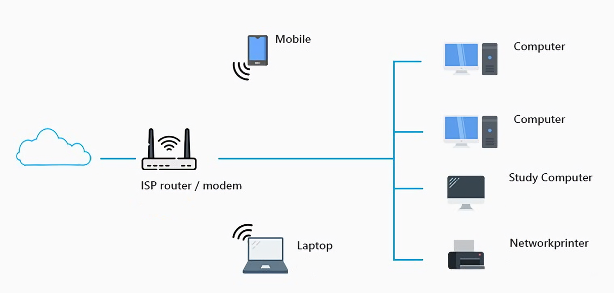
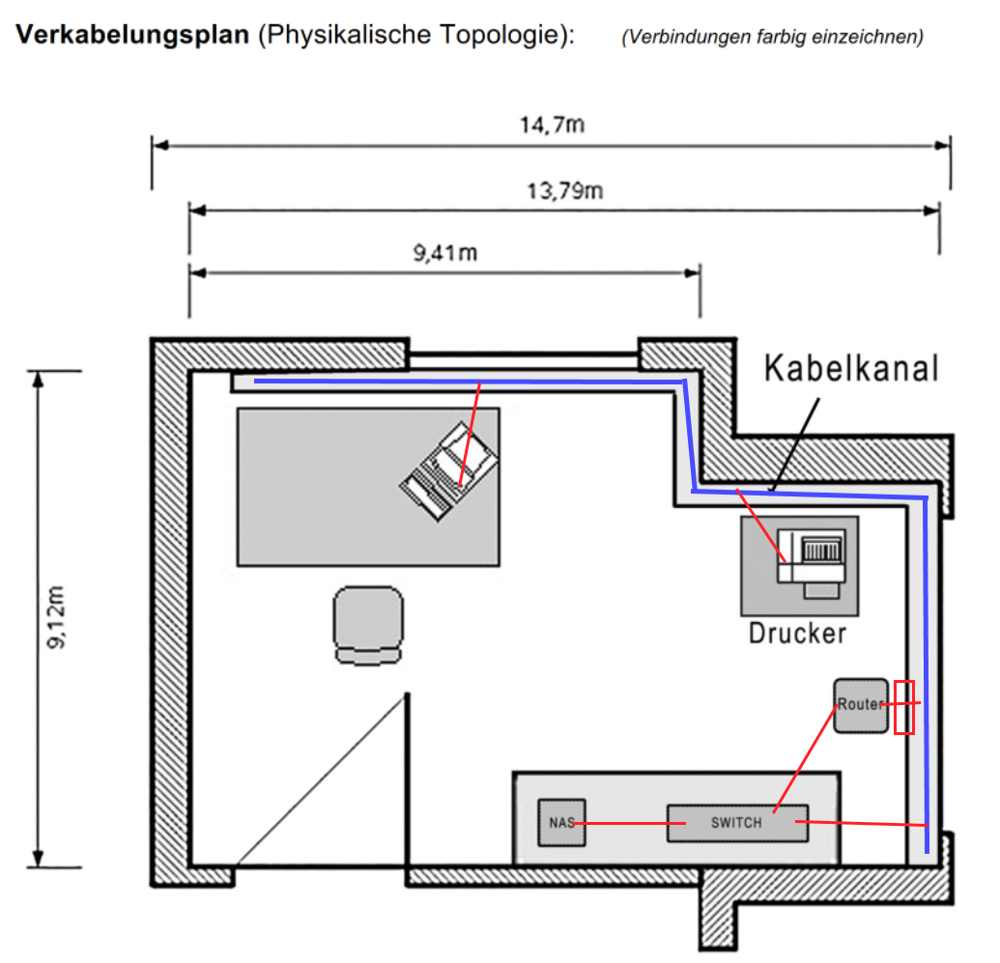

# Aufgaben zu text

---

## 1. Verständnisfragen zum vorliegenden Text

##### Was ist ein LAN und welche Netzwerktopologie treffen sie in aktuellen LANs an? Abgrenzung zu WAN?
local area network, baum topologie, wan ist viel weiter / groesser.

##### Draht, Litze oder Glasfaser? Fassen sie zusammen, wo und warum welche Technologie verwendet wird.
> Draht: billig, einfach legbar, Verwendung in UGV-Verkablungen: Universelle Gebäudeverkabelung = Strukturierte Verkabelung in Gebäuden, Büros etc.
> Litze: teurer, Verwendung bei Patch-Kabeln: Verbindung von Steckdose zu Endgerät wie PC/Server oder Netzwerkkomponente
> Glasfaser: billige prod. jedoch teurer, bei endmontage. lässt prinzipiell eine hohe Datenübertragung zu, erfordert aber auch eine entsprechend leistungsfähige (schnelle) Elektronik.

##### Welche Konzepte zur Abwehr von Störeinflüssen auf Kabel kennen sie?
> - Abschirmung: Shielding/Screening]
>   - schuetzt vor aussen kommendem strom.
> - Verdrillte Leitungspaare: Twisted Pair
>   - Störungen wirken auf beide Drähte gleichzeitig und heben sich dank der verdrillten Paar-Anordnung gegenseitig auf.

##### Sie haben herausgefunden, dass bei der Netzwerkverkabelung in ihrer Firma S/FTP-Kabel der Kategorie 7 verbaut wurde. Erklären sie!
> sie wollten schnellen, und sicheren datentransport haben.

##### Welcher Ethernet-Medientyp wird heute üblicherweise anzutreffen?
> s/ftp

##### Sie möchten ein Ethernetkabel selber herstellen. Was benötigen sie dazu?
> 1000 BASE T besteht aus 4 Leiterpaaren (D1+, D1-, D2+, D2-,D3+, D3-,D4+, D4-), welche die Daten Bi-Direktional übertragen.

##### Warum werden Ethernetverbindungen ausgekreuzt. Und braucht es das heute wirklich noch? (Tipp: Auto MDI-X)
Bei heutigen switches wird automatisch erkannt, ob das Signal ausgekraeutzt werden muss oder nicht. Heute ist ein Kabel bi direktional.

##### Erklären sie einem Laien, was unter dem Begriff UGV zu verstehen ist.
Universelle Gebaeude Verkabelnung stellt den einheitlichen aufbau einer verkabelung dar.

##### Skizzieren sie das Netzwerk bei ihnen zuhause. Zeichnen sie die logische Topologie und den Verkablungsplan auf. In ihren Skizzen sollen alle PC's, Notebooks, (ADSL-)Router, Switchs, WLAN-AP's, Ethernetkabel etc. erscheinen.

---

### 2. HW zum anfassen

Bezeichnung: Drahtkabel & Litze Kabel
Zweck: UGV-Verkablungen, Patch-Kabeln
Preis: Draht: 17eur/100m Litze: 20eur/100m

altes bus topologie gerät, welches den Datenfluss "steuert"

verschiedene störeinfluss abwehr

Crimpzange, mit der man kabel crimpen kann 

Glasfaser Kabel

RJ45 steckplatz

Switch

---

## 3. HW evaluieren

man braucht:

[3 RJ-45 kabel](https://www.digitec.ch/de/s1/product/digitec-ethernet-patchkabel-rj45-sftp-kat-6a-2-m-netzwerkkabel-12118160?supplier=406802)
[1 Switch](https://www.fs.com/de/products/129514.html?country=CH&currency=CHF&languages=Deutsch&paid=google_shopping&gclid=EAIaIQobChMI7KLy4Jfm9wIVh7h3Ch1TugvPEAQYBCABEgKfifD_BwE)

---

## 4. Eigenes Intranet analysieren

---

## 5. Internet Provider Suchen
##### Swisscom
- Swisscom
- 300 Mbit/s Download
- Gratis Router
- 80 CHF / Monat
- Surfschutz

##### Sunrise
- Sunrise
- 100 Mbit/s Download
- kein gratis Router
- 29 CHF / Monat - 55 CHF / Monat
- Surfschutz

---

## 6. Verkabelungsplan erstellen:

